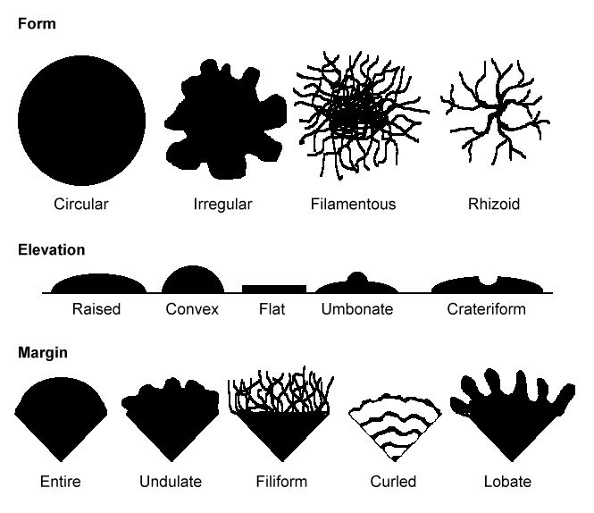

```{r "load packages", include=FALSE, message=FALSE}
library(tidyverse)
```

## Measuring Bacterial Growth Rate is Difficult in Natural Systems
How quickly do bacteria grow? Using culture, this is a relatively easy question to answer. One can allow bacteria to divide in a culture-medium of their choice, count the number of cells at the beginning and end of a certain time interval, and count the new cells produced. But what about bacteria that cannot be cultured in the lab? What about bacteria that grow so slowly that culturing them is either impossible or unfeasible?

One of the most studied bacteria, *E. coli*, can divide once every half an hour in culture. What about other bacteria?

### Task 1A: Think About Slow-Growing Microbes
How long would one have to wait for a bacterial colony to be visible on a plate with a doubling time of 30 minutes? 12 hours? One day? A month? A year?

Let's say a "visible" bacterial colony on a petri dish is a colony with 6E8 cells within it. Assuming logarithmic, binary fission replication, the number of bacterial cells ($N_t$) at time t is given by:

$$
N_t = N_0 \cdot 2^k
$$
where $k$ is the number of divisions and $N_0$ is the starting population.



Assuming that a colony of 6E8 cells on a petri dish is what is required to be visible to the human eye, how quickly would a bacterium doubling every 20 minutes become visible? What about a bacterium that divides once per month?

NOTE: "Generation time" is the time required for one cell doubling.

```{r}
colonies <- tibble(
  gen_time_hr = seq(0.3, 730, by = 0.5), # a set of generation times in divisions per hour
  gen_time_day = gen_time_hr / 24, # convert to days
  cells_required = 6E8, # a constant telling us the threshold at which a colony becomes visible 
  divisions_required = "YOUR ANSWER HERE", # calculate how many binary cell divisions are required to reach the visible threshold
  time_required_hr = "YOUR ANSWER HERE", # determine time required in hours
  time_required_day = "YOUR ANSWER HERE" # determine time required in days
)

times <- c(24, 72, 730) # one day, three days, one month

colonies %>% ggplot(aes(x = gen_time_day, y = time_required_day)) +
  geom_line(color = "red") +
  scale_y_log10() +
  ggtitle("Time for Visible Colony to Form Based on Doubling Time") +
  xlab("Generation Time (Days)") +
  ylab("Time Required for Visible Colony (Days)") +
  geom_hline(yintercept = times, linetype = "dotted") +
  theme_classic()
```

NOTE: This model makes numerous assumptions that lead to under-estimates of the time required for bacterial colony emergence:
- No lag phase in growth
- The bacterium is grown on an ideal medium and does not have any competitors
- The bacterium is capable of clonal growth
- The colony experiences no cell death
- The colony morphology is that of a perfect ellipsoid of volume 1mm x 1mm x 0.6mm.
- A colony of population 6E8 becomes instantaneously visible.


## Microbial Activity Measurements using Lipid Stable Isotope Probing (SIP)
The changes in microbial biomass $B$ are governed by the specific growth rate $µ$ (cellular division), turnover rate $\omega$ (biomass synthesis in excess of growth). We can express these as differential equations:

$$
\frac{dB}{dt} = (µ + \omega - \omega - d) \cdot B = (µ - d)\cdot B
$$
In other words: the change in total biomass $B$ is equal to the current biomass times replication rate minus death, where turnover "maintenance" $\omega$ results in no net biomass production.

The rate of change in *new* biomass is the difference between the flux terms of biomass synthesis and biomass removal:

$$
\frac{dB_{new}}{dt} = (µ + \omega) \cdot B - (d+\omega)\cdot B_{new}
$$
The first term containing µ, $\omega$, and $B$ describes biomass synthesis flux and is equal to replication plus maintenance rate. The second term containing $d$, $\omega$, and $B_{new}$ describes removal of biomass.

We can define a differential equation for the fraction of new vs. total biomass using the quotient rule and solving via integration (omitted for brevity - see *Kopf et al. 2016 Supplemental* for derivation).

$$
f^`_{B_{new}} (t) = (µ + \omega) \cdot e^{-(µ + \omega) \cdot t} \\
f_{B_{new}} (t) = 1 - e ^{-(µ + \omega) \cdot t}
$$

Consider a case of a population that is exposed to an isotopically enriched tracer (in our case, this is deuterium-enriched water $^2H$). The $^2H$ composition of newly enriched biomass will have a distinct hydrogen isotope composition that reflects tracer addition -- $^2F_{B_{new}}$. We can use mass balance between the newly produced and original biomass to determine the overall isotopic composition of biomass at time t:

$$
^2F_B (t) = \frac{B_{new}}{B} \cdot ^2F_{B_{new}} + \frac{B_{original}}{B} \cdot ^2F_{B_{original}}
$$
The terms containing $B_{new}$ and $B_{original}$ represent the mass fractions of new and original biomass, respectively.

In the (simplified) case where new biomass mirrors the isotopic composition of the tracer solution (heavy water), we can assume that $^2F_{B_{new}} = ^2F_{w_{spiked}}$, where $^2F_{w_{spiked}}$ is the fractional abundance of $^2H$ in the tracer solution.

Assuming that maintenance turnover is zero ($\omega = 0$), we can simplify to:

$$
^2F_{B} (t) = ^2F_{w_{spiked}} \cdot (1 - e^{-µt}) + ^2F_{B_{original}} \cdot e^{-µt}
$$

### Task 1B: Plot Isotopic Enrichment of Biomass
Using the above equation, plot isotopic enrichment of biomass as a function of time.

```{r}
biomass_estimate <- tibble(
  t = seq(0, 2, by = 0.01),
  f_wspiked = 1, # consider tracer to be pure
  u = 1, # constant growth rate
  f_Boriginal = 0, # assume zero incorporation at start
  f_B = "YOUR ANSWER HERE"
)

ggplot(data = biomass_estimate, aes(x = t, y = f_B * 100)) + # changed f_B to percentage
  geom_line() +
  ylab("Isotopic Enrichment (%)") +
  xlab("Time") +
  theme_classic()
```


Here we can change to a simpler notation and incorporate an additional term "$a$"
$F(t)$ : Isotopic enrichment as a function of time
$F_L$ : Isotopic enrichment of the label (in atom % of the minor isotope)
$a$ : Assimilation efficiency of the tracer (from 0 to 1). $a$ takes into account kinetic isotope effects and tracer diffusion effects.
$F_0$ : The isotopic composition of biomass at $t=0$
$µ$ : Specific growth rate
$t$ : Time

$$
F_T = a \cdot F_L \left(1-e^{-\mu\cdot t}\right) + F_{0} \cdot e^{-\mu \cdot t}
$$

Substituting the growth rate for the expected generation time ($µ=\ln(2)/T$), one can readily calculate the required labeling time to reach a target isotopic composition $F_t$:

$$
t = \frac{T}{\ln(2)} \cdot \ln \left(\frac{a\cdot F_L - F_0}{a\cdot F_L - F_t}\right)
$$
For an interactive demonstration of using this labeling calculator, I suggest https://kopflab.shinyapps.io/isolabel/.

### Task 1C: Derive the Conversion of Growth Rate into Generation Time (Doubling Time)

Exponential growth is commonly notated as:
$$
N_t = N_0 \cdot e^{µt}
$$
Where µ is specific growth rate, t is time, $N_0$ is starting population and $N_t$ is population at time t.

Using this, solve for the *doubling time* $t$, the amount of time required for a quantity doubling.

$$
N_t = N_0 \cdot e^{µt} \\
 ...\\
 your \space answer\\
 ...
$$

This equation will come in handy later!

## Calculate Generation Times from Isotopic Enrichment Data

### Task 2A: Define a Function to Compute Growth Rate from Isotopic Enrichment Data
First, using the equation for isotopic enrichment in the presence of tracer, solve for the growth rate $µ$.

Then, define an R function `gencalc` that calculates generation time based on label incorporation. The function should have the following arguments:
- a : assimilation efficiency (default to 50% = 0.5)
- FT : resultant isotopic enrichment
- F0 : initial isotopic enrichment
- FL : isotopic label strength (default to 0.5% = 0.005)
HINT: You can use `case_when()` to avoid dividing by zero - https://dplyr.tidyverse.org/reference/case_when.html.


$$
F_T = a \cdot F_L \left(1-e^{-\mu\cdot t}\right) + F_{0} \cdot e^{-\mu \cdot t} \\
\downarrow \\
solve \space for \space \mu \\
\downarrow \\
 your \space answer\\
$$


```{r}
gencalc <- function(a, FT, F0, FL, t) {
  ### Your answer
}
```


### Task 2B: Calculate Generation Times
Here, I provide some example data from which we can compute generation times. Three novel bacteria, *Pseudomonas tristanii*, *Bacillus isotopus*, and *Xerothermodurans ralphus* were grown in the presence of a $^2H$ at 0.5at%. Compute the growth rate in hours, `u_hr`, as well as the generation time in days, `gen_d`. The lipid compound we are probing is iso 15:0, an unsaturated 15C fatty acid with an iso branch. Isotope data is given in $\delta^2H$ permil. Assume assimilation efficiency `a` is 0.5 (50%). Assume that $F_0$, the initial isotopic composition of the target lipid, is the same across bacteria.

```{r}
ref_ratio = 0.0001557643 # reference ratio (VSMOW) of 2H 

iso_data <- tibble(
  bacterium = c("Pseudomonas tristanii", "Bacillus isotopus", "Xerothermodurans ralphus"),
  compound = "iso 15:0",
  t = c(50, 50, 50), # labeling time in hours
  d2H = c(40.193510, 133.178118, 612.08982), # delta 2H values in permil measured after labeling time
  R = "YOUR ANSWER", # convert delta to isotope ratio
  FT = (R / (1+R)), # convert isotope ratio to fractional abundance
  FL = 0.005, # tracer strength of 0.005 (0.5at%)
  t0 = 0, # time zero = 0
  a = 0.5, # assimilation efficiency
  F0 = 0.0001505666, # baseline 2H abundance before labeling experiment
  d_FT = FT - F0, # change in isotopic composition
  d_t = t - t0, # change in time
  u_hr = "YOUR ANSWER", # growth rate in hours
  u_d = "YOUR ANSWER", # growth rate in days
  gen_d = "YOUR ANSWER" # generation time in days
)
```

Plot the generation times for each species of bacteria.

```{r}
iso_data %>% ggplot(aes(x = bacterium, y = gen_d)) +
  geom_bar(aes(fill = bacterium), stat = "identity") +
  coord_flip() +
  scale_fill_viridis_d() +
  ylab("Generation time (Days)") +
  theme_classic()
```


